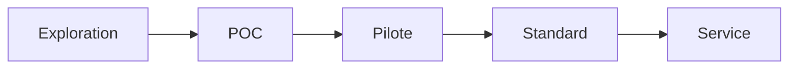

# Innovation Status

## Statut actuel du projet

- [ ] Exploration
- [x] POC
- [ ] Pilote
- [ ] Standard interne
- [ ] Service production

## Métadonnées
- Date de création: 2026-02-22
- Responsable: Équipe plateforme IA temps réel
- Prochaine étape attendue: Pilote sur un périmètre métier limité (support client)

## Critères de passage au niveau supérieur (POC -> Pilote)
- Latence p95 validée sur charge cible
- Runbook d'exploitation documenté
- KPI métier collectés pendant 2 semaines
- Feedback utilisateurs >= seuil défini par le métier

## Risques identifiés
- Dépendance à des APIs externes (STT/LLM/TTS)
- Variabilité de latence réseau
- Coûts variables selon volumétrie audio

