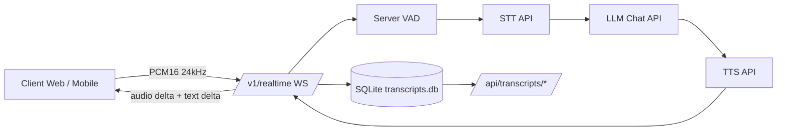

# Architecture

## Décisions clés

- FastAPI pour unifier API REST et WebSocket.
- Pipeline externalisé (STT/LLM/TTS) pour flexibilité fournisseur.
- SQLite local pour traçabilité/rejeu sans infra lourde.
- Métriques/OTEL natifs pour observabilité de bout en bout.
