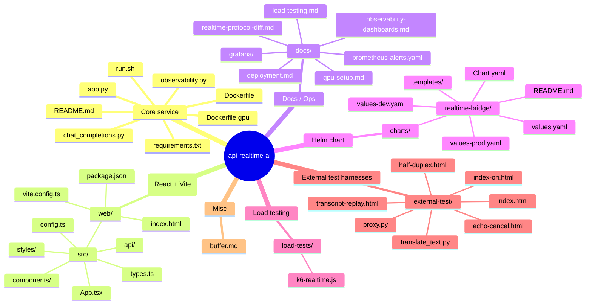

# Repository Mind Map

```mermaid
mindmap
  root((api-realtime-ai))
    Core service
      app.py
      chat_completions.py
      observability.py
      requirements.txt
      run.sh
      Dockerfile
      Dockerfile.gpu
      README.md
    Web UI (React + Vite)
      web/
        src/
          App.tsx
          api/
          components/
          styles/
          config.ts
          types.ts
        index.html
        package.json
        vite.config.ts
    Docs / Ops
      docs/
        deployment.md
        gpu-setup.md
        load-testing.md
        observability-dashboards.md
        realtime-protocol-diff.md
        prometheus-alerts.yaml
        grafana/
    Helm chart
      charts/
        realtime-bridge/
          Chart.yaml
          templates/
          values.yaml
          values-dev.yaml
          values-prod.yaml
          README.md
    Load testing
      load-tests/
        k6-realtime.js
    External test harnesses
      external-test/
        index.html
        index-ori.html
        echo-cancel.html
        half-duplex.html
        transcript-replay.html
        proxy.py
        translate_text.py
    Misc
      buffer.md
```
